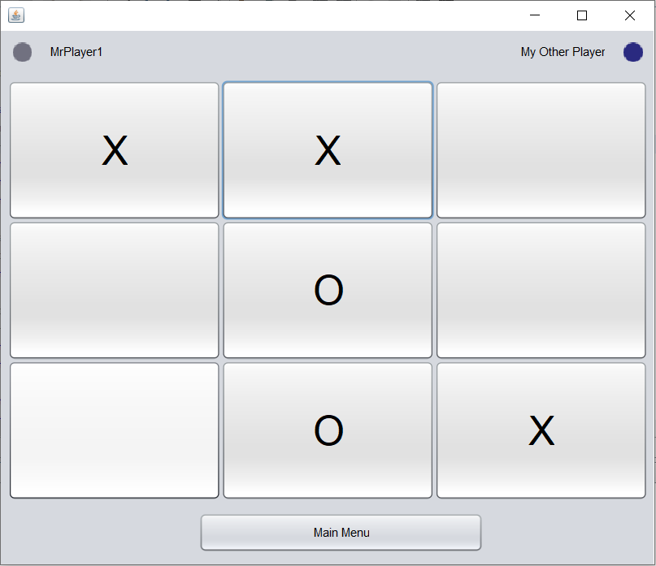

# Tic-Tac-Toe

A Java generalised implementation of Tic-Tac-Toe (you can make a board of any size, and win with any number of cells in a row).

## Screenshots

Gameplay:

## History

This was originally written for the final assignment of my college Programming module.

## Build/Run

To build/run, use NetBeans.
